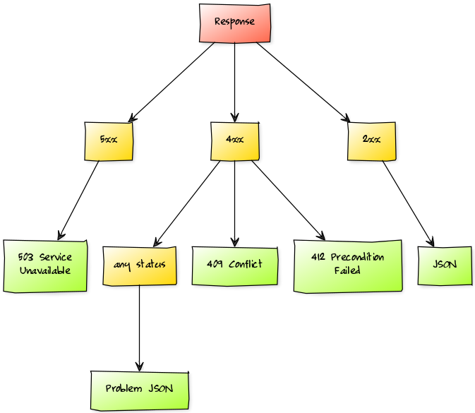

# Riptide: Client-side response routing

[](http://pixabay.com/en/wave-water-sea-tsunami-giant-wave-11061/)

[](https://travis-ci.org/zalando/riptide)
[](https://coveralls.io/r/zalando/riptide)
[](http://www.javadoc.io/doc/org.zalando/riptide-core)
[](https://github.com/zalando/riptide/releases)
[](https://maven-badges.herokuapp.com/maven-central/org.zalando/riptide-core)

> **Riptide** (ˈrɪpˌtaɪd), noun: a strong usually narrow current of water that flows away from a shore

*Riptide* is a library that implements ***client-side response routing***.  It tries to fill the gap between the HTTP
protocol and Java as a [single-dispatch](https://en.wikipedia.org/wiki/Dynamic_dispatch#Single_and_multiple_dispatch)
language. Riptide allows users to leverage the power of HTTP with its unique API.

- **Technology stack**: Based on `spring-web` and uses the same foundation as Spring's RestTemplate.
- **Status**:  Version 1.x is used in production and 2.x is currently available as a release candidate.
- Riptide is unique in the way that it doesn't abstract HTTP away, but rather embrace it!

## Example

Usage typically looks like this:

```java
http.get("/repos/{org}/{repo}/contributors", "zalando", "riptide")
    .dispatch(series(),
        on(SUCCESSFUL).call(listOf(User.class), users -> 
            users.forEach(System.out::println)));
```

We have an adaptation of the canonical Github sample, see [`SampleService`](riptide-core/src/test/java/org/zalando/riptide/SampleService.java).
Feel free to compare this e.g. to [Feign](https://github.com/Netflix/feign#basics) or
[Retrofit](https://github.com/square/retrofit/blob/master/samples/src/main/java/com/example/retrofit/SimpleService.java).

## Features

- full access to the underlying HTTP client
- encourages to write more resilient clients, by forcing you to consider
  - fallbacks
  - content negotiation and versioning
  - robust error handling
- elegant syntax
- type-safe

## Concepts

Most modern clients try to adapt HTTP to single-dispatch paradigm like shown in the following example. Even though this
may be perfectly suitable for most applications it takes away a lot of the power that comes with HTTP. It's not easy to
support multiple different return values, i.e. distinct happy cases. Access to response headers or manual content
negotiation are also harder to do.
 
```java
@GET
@Path("/repos/{org}/{repo}/contributors")
List<User> getContributors(@PathParam String org, @PathParam String repo);
```
Riptide tries to counter this by provided a different approach to make HTTP available in the JVM.
It allows to dispatch HTTP responses very easily to different handler methods based on any characteristic of the
response, including but not limited to status code, status family and content type. The way this works is intentionally
very similar to server-side request routing where any request that reaches a web application is usually routed to the
correct handler based on any combination of the following criteria: URI including query and path parameters, method,
`Accept` and `Content-Type` header. Instead of routing requests to handler methods on the server what *Riptide* does
is the exact opposite: routing responses to handler methods on the client side.



## Installation

Add the following dependency to your project:

```xml
<dependency>
    <groupId>org.zalando</groupId>
    <artifactId>riptide-core</artifactId>
    <version>${riptide.version}</version>
</dependency>
```

Additional modules/artifacts of Riptide always share the same version number.

## Configuration

```java
Rest.builder()
    .baseUrl("https://api.github.com")
    .requestFactory(new HttpComponentsAsyncClientHttpRequestFactory())
    .converter(new MappingJackson2HttpMessageConverter())
    .converter(new Jaxb2RootElementHttpMessageConverter())
    .build();
```

Since all properties are optional the following code is the bare minimum:

```java
Rest.builder().build();
```

This defaults to:
- no base URL
- `SimpleClientHttpRequestFactory` (based on `java.net.HttpURLConnection`)
- same list of converters as `new RestTemplate()`

## Usage

A full-blown request may contain any of the following aspects: HTTP method, request URI, query parameters,
headers and a body:

```java
http.post("/sales-order")
    .queryParam("async", "true")
    .contentType(CART)
    .accept(SALES_ORDER)
    .header("Client-IP", "127.0.0.1")
    .body(cart)
    .dispatch(series(),
        on(SUCCESSFUL).dispatch(contentType(),
            on(SALES_ORDER).call(this::persistLocationHeader)),
        anySeries().call(problemHandling())
    .join()
```
Riptide the the following HTTP methods: `get`, `head`, `post`, `put`, `patch`, `delete`, `options` and `trace`
respectively. Query parameters can either be provided individually using `queryParam(String, String)` or multiple at 
once with `queryParams(Multimap<String, String>)`. The `Content-Type`- and `Accept`-header have type-safe methods in
addition to the generic support that is `header(String, String)` and `headers(HttpHeaders)`.

```java
http.post("/sales-order")
    .contentType(SALES_ORDER)
    .accept(SALES_ORDER)
    .body(order)
    .dispatch(series(),
        on(SUCCESSFUL).dispatch(contentType(),
            on(SALES_ORDER).call(this::persistLocationHeader),
        on(CLIENT_ERROR).dispatch(status(),
            on(CONFLICT).call(this::retry),
            on(PRECONDITION_FAILED).call(this::readAgainAndRetry),
            anyStatus().dispatch(contentType(),
                on(MediaTypes.PROBLEM_JSON).call(ThrowableProblem.class, propagate()))),
        on(SERVER_ERROR).dispatch(status(),
            on(SERVICE_UNAVAILABLE).call(this::scheduleRetryLater))));
```

The callbacks used can have the following signatures:

```java
private void persistLocationHeader(ClientHttpResponse response)
private void retry();
private void propagate(ThrowableProblem problem);
```

### Routes

```java
@FunctionalInterface
public interface Route {

    void execute(ClientHttpResponse response, MessageReader reader) throws Exception;
    
}
```

#### Bindings

| Action                                    | Syntax                                |
|-------------------------------------------|---------------------------------------|
| `ThrowingRunnable`                        | `on(..).call(Runnable)`               |
| `ThrowingConsumer<ClientHttpResponse>`    | `on(..).call(Consumer)`               |
| `ThrowingConsumer<T>`                     | `on(..).call(Class<T>, Consumer)`     |
| `ThrowingConsumer<T>`                     | `on(..).call(TypeToken<T>, Consumer)` |
| Nested Routing                            | `on(..).dispatch(..)`                 |

#### Nested Dispatch

TODO reference other example (e.g. from concept)

If a *no match* case happens in a nested routing scenario it will bubble up the levels until it finds a matching
wildcard condition. In the example above, if the server responded with a plain `500 Internal Server Error` the
router would dispatch on the series, entering `on(SERVER_ERROR)` (5xx), try to dispatch on status code, won't find a
matching condition and neither a wildcard so it would bubble up and be *caught* by the `anySeries().call(..)`
statement.

TODO
- table with examples

### Routing Trees

TODO
- bind vs. alternatives
- mutation/manipulation/reuse
- code as data

### Navigators

Routing of responses is controlled by a `Navigator`, e.g. `status()` in the former example.
A navigator decides how to travers a [routing tree](#routing-tree).

Riptide comes with the following navigators:

- [Navigators.series()](riptide-core/src/main/java/org/zalando/riptide/SeriesNavigator.java)
- [Navigators.status()](riptide-core/src/main/java/org/zalando/riptide/StatusNavigator.java)
- [Navigators.statusCode()](riptide-core/src/main/java/org/zalando/riptide/StatusCodeNavigator.java)
- [Navigators.reasonPhrase()](riptide-core/src/main/java/org/zalando/riptide/ReasonPhraseNavigator.java)
- [Navigators.contentType()](riptide-core/src/main/java/org/zalando/riptide/ContentTypeNavigator.java)

#### Custom Navigator

You are free to write your own, which requires you to implement the following interface:

```java
@FunctionalInterface
public interface Navigator<A> {

    Optional<Route> navigate(ClientHttpResponse response, RoutingTree<A> tree) throws IOException;

}
```

### Futures and Completion

- TODO future/blocking/chaining

### Exceptions

*Riptide* propagates any exception as an `ExecutionException` upon calling `Future.get(..)`:

```java
try {
    rest.execute(GET, url).dispatch(..).get(10, SECONDS);
} catch (final ExecutionException e) {
    // TODO implement
}
```

```java
try {
    rest.execute(GET, url).dispatch(..).join;
} catch (final CompletionException e) {
    // TODO implement
}

The only special custom exception you may get is `NoRouteException`, if and only if there was no matching condition and
no wildcard condition either.

## Getting help

If you have questions, concerns, bug reports, etc, please file an issue in this repository's Issue Tracker.

## Getting involved

To contribute, simply make a pull request and add a brief description (1-2 sentences) of your addition or change.
For more details check the [contribution guidelines](CONTRIBUTING.md).

## Credits and references

- [URL routing](http://littledev.nl/?p=99)
