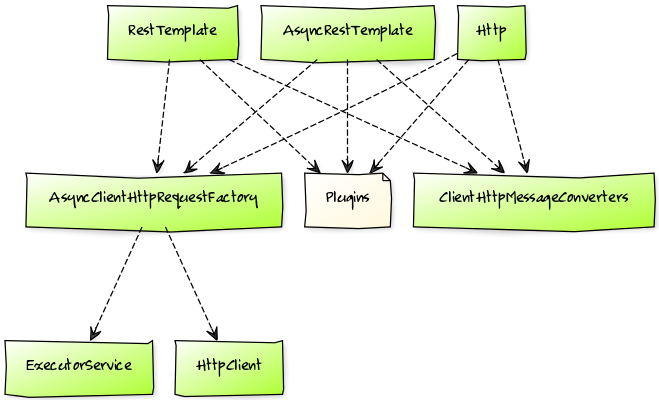
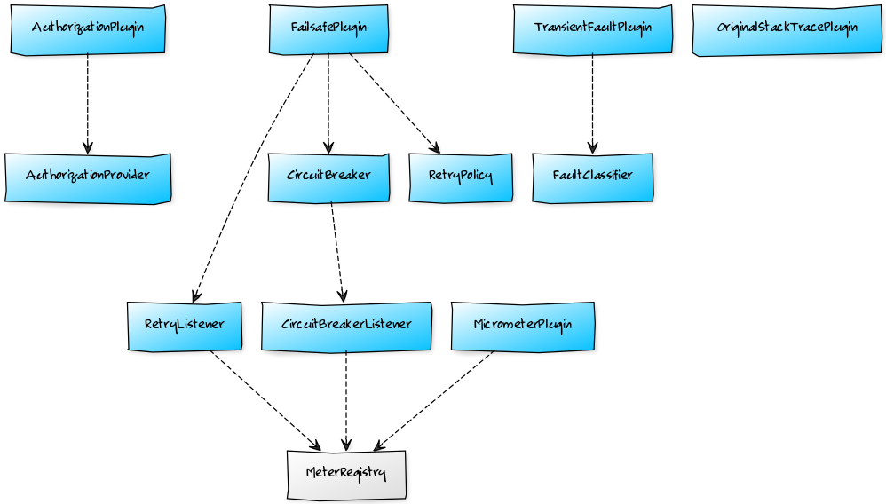
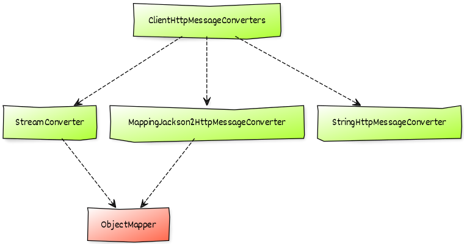

# Riptide: Spring Boot Starter

[](https://pixabay.com/en/leaf-green-foliage-green-leaves-1001679/)

[](https://travis-ci.org/zalando/riptide)
[](https://coveralls.io/r/zalando/riptide)
[](https://www.codacy.com/app/whiskeysierra/riptide)
[](http://www.javadoc.io/doc/org.zalando/riptide-spring-boot-starter)
[](https://github.com/zalando/riptide/releases)
[](https://maven-badges.herokuapp.com/maven-central/org.zalando/riptide-spring-boot-starter)
[](https://raw.githubusercontent.com/zalando/riptide/master/LICENSE)

*Riptide: Spring Boot Starter* is a library that seamlessly integrates various HTTP client-side tools in the
easiest and convenient way possible. It solves a recurring problem of bootstrapping and wiring different libraries
together whenever interaction with a remote service is required. Spinning up new clients couldn't get any easier!

- **Technology stack**: Spring Boot
- **Status**:  Beta

## Example

```yaml
riptide.clients:
  example:
    base-url: http://example.com
    connect-timeout: 150 milliseconds
    socket-timeout: 100 milliseconds
    connection-time-to-live: 30 seconds
    max-connections-per-route: 16
    retry:
      fixed-delay: 50 milliseconds
      max-retries: 5
    circuit-breaker:
      failure-threshold: 3 out of 5
      delay: 30 seconds
      success-threshold: 5 out of 5
```

```java
@Autowired
@Qualifier("example")
private Http example;
```

## Features

- Seamless integration of:
  - [Riptide](https://github.com/zalando/riptide)
  - [Logbook](https://github.com/zalando/logbook)
  - [Tracer](https://github.com/zalando/tracer)
  - [Tokens](https://github.com/zalando-stups/tokens) (plus [interceptor](https://github.com/zalando-stups/stups-spring-oauth2-support/tree/master/stups-http-components-oauth2))
  - [Jackson 2](https://github.com/FasterXML/jackson)
  - [HttpClient](https://hc.apache.org/httpcomponents-client-ga/index.html)
  - [Failsafe](https://github.com/jhalterman/failsafe) via [Riptide: Failsafe](../riptide-failsafe)
  - [Metrics](https://micrometer.io) via [Riptide: Metrics](../riptide-metrics)
- [Spring Boot](http://projects.spring.io/spring-boot/) Auto Configuration
- Automatically integrates and supports:
  - Transient fault detection via [Riptide: Faults](../riptide-faults)
  - Backup requests via [Riptide: Backup](../riptide-backup)
  - HTTP JSON Streaming via [Riptide: Stream](../riptide-stream)
  - Timeouts via [Riptide: Timeout](../riptide-timeout)
- SSL certificate pinning
- Sensible defaults

## Dependencies

- Java 8
- Spring Boot 1.x **or 2.x**
- Riptide
  - Core
  - (Apache) HTTP Client
  - Backup (optional)
  - Failsafe (optional)
  - Faults (optional)
  - Metrics (optional)
  - Timeouts (optional)
- Logbook (optional)
- Tracer (optional)
- Tokens (optional)

## Installation

Add the following dependency to your project:

```xml
<dependency>
    <groupId>org.zalando</groupId>
    <artifactId>riptide-spring-boot-starter</artifactId>
    <version>${riptide.version}</version>
</dependency>
```

### Optional Dependencies

You will need to add declare the following dependencies, in order to enable some integrations and/or features:

#### [Failsafe](../riptide-failsafe) integration

Required for `retry` and `circuit-breaker` support.

```xml
<dependency>
    <groupId>org.zalando</groupId>
    <artifactId>riptide-failsafe</artifactId>
    <version>${riptide.version}</version>
</dependency>
```

#### [Transient Fault](../riptide-faults) detection

Required when `detect-transient-faults` is enabled.

```xml
<dependency>
    <groupId>org.zalando</groupId>
    <artifactId>riptide-faults</artifactId>
    <version>${riptide.version}</version>
</dependency>
```

#### [Backup Requests](../riptide-backup)

Required when `backup-request` is configured:

```xml
<dependency>
    <groupId>org.zalando</groupId>
    <artifactId>riptide-backup</artifactId>
    <version>${riptide.version}</version>
</dependency>
```

#### [Timeout](../riptide-timeout) support

Required when `timeout` is enabled. Not to be confused with `connect-timeout` and `socket-timeout`, those are
supported out of the box.

```xml
<dependency>
    <groupId>org.zalando</groupId>
    <artifactId>riptide-timeout</artifactId>
    <version>${riptide.version}</version>
</dependency>
```

#### [Logbook](https://github.com/zalando/logbook) integration

```xml
<dependency>
    <groupId>org.zalando</groupId>
    <artifactId>logbook-spring-boot-starter</artifactId>
    <version>${logbook.version}</version>
</dependency>
```

#### [Tracer](https://github.com/zalando/tracer) integration

```xml
<dependency>
    <groupId>org.zalando</groupId>
    <artifactId>tracer-spring-boot-starter</artifactId>
    <version>${tracer.version}</version>
</dependency>
```

#### OAuth support

Required for `oauth` support.

```xml
<dependency>
    <groupId>org.zalando.stups</groupId>
    <artifactId>stups-http-components-oauth2</artifactId>
    <version>${stups-http-components-oauth2.version}</version>
</dependency>
<dependency>
    <groupId>org.zalando.stups</groupId>
    <artifactId>tokens</artifactId>
    <!-- 0.11.0-beta-2 or higher! -->
    <version>${tokens.version}</version>
</dependency>
```

#### [Metrics](../riptide-metrics) integration

Required when `record-metrics` is enabled. 

```xml
<dependency>
    <groupId>org.zalando</groupId>
    <artifactId>riptide-metrics</artifactId>
    <version>${riptide.version}</version>
</dependency>
```

Spring Boot 1.x applications also require:

```xml
<dependency>
    <groupId>io.micrometer</groupId>
    <artifactId>micrometer-spring-legacy</artifactId>
    <version>${micrometer.version}</version>
</dependency>
```

Please be aware that Micrometer, by default, doesn't expose to `/metrics`.
Consult [#401](https://github.com/zalando/riptide/issues/401) for details how to bypass this.

## Configuration

You can now define new clients and override default configuration in your `application.yml`:

```yaml
riptide:
  oauth:
    access-token-url: https://auth.example.com
    credentials-directory: /secrets
    scheduling-period: 10 seconds
    connect-timeout: 1 second
    socket-timeout: 1500 milliseconds
  clients:
    example:
      base-url: http://example.com
      connect-timeout: 150 milliseconds
      socket-timeout: 100 milliseconds
      connection-time-to-live: 30 seconds
      max-connections-per-route: 16
      thread-pool:
        min-size: 4
        max-size: 16
        keep-alive: 1 minnute
        queue-size: 0
      preserve-stack-trace: true
      detect-transient-faults: true
      retry:
        fixed-delay: 50 milliseconds
        max-retries: 5
        max-duration: 2 second
        jitter: 25 milliseconds
      circuit-breaker:
        failure-threshold: 3 out of 5
        delay: 30 seconds
        success-threshold: 5 out of 5
      backup-request:
        delay: 75 milliseconds
      timeout: 500 milliseconds
      oauth.scopes:
        - example.read
```

Clients are identified by a *Client ID*, for instance `example` in the sample above. You can have as many clients as you want.

For a complete overview of available properties, they type and default value please refer to the following table:

| Configuration                           | Data type      | Default / Comment                                |
|-----------------------------------------|----------------|--------------------------------------------------|
| `riptide`                               |                |                                                  |
| `├── defaults`                          |                |                                                  |
| `│   ├── url-resolution`                | `String`       | `rfc`, not applicable to Async/RestTemplate      |
| `│   ├── connect-timeout`               | `TimeSpan`     | `5 seconds`                                      |
| `│   ├── socket-timeout`                | `TimeSpan`     | `5 seconds`                                      |
| `│   ├── connection-time-to-live`       | `TimeSpan`     | `30 seconds`                                     |
| `│   ├── max-connections-per-route`     | `int`          | `20`                                             |
| `│   ├── max-connections-total`         | `int`          | `20` (or at least `max-connections-per-route`)   |
| `│   ├── thread-pool`                   |                |                                                  |
| `│   │   ├── min-size`                  | `int`          | `1`                                              |
| `│   │   ├── max-size`                  | `int`          | same as `max-connections-total`                  |
| `│   │   ├── keep-alive`                | `TimeSpan`     | `1 minute`                                       |
| `│   │   └── queue-size`                | `int`          | `0`                                              |
| `│   ├── detect-transient-faults`       | `boolean`      | `false`                                          |
| `│   ├── preserve-stack-trace`          | `boolean`      | `true`                                           |
| `│   ├── record-metrics`                | `boolean`      | `false`                                          |
| `│   ├── retry`                         |                |                                                  |
| `│   │   ├── fixed-delay`               | `TimeSpan`     | none, mutually exclusive to `backoff`            |
| `│   │   ├── backoff`                   |                | none, mutually exclusive to `fixed-delay`        |
| `│   │   │   ├── delay`                 | `TimeSpan`     | none, requires `backoff.max-delay`               |
| `│   │   │   ├── max-delay`             | `TimeSpan`     | none, requires `backoff.delay`                   |
| `│   │   │   └── delay-factor`          | `double`       | `2.0`                                            |
| `│   │   ├── max-retries`               | `int`          | none                                             |
| `│   │   ├── max-duration`              | `TimeSpan`     | none                                             |
| `│   │   ├── jitter-factor`             | `double`       | none, mutually exclusive to `jitter`             |
| `│   │   └── jitter`                    | `TimeSpan`     | none, mutually exclusive to `jitter-factor`      |
| `│   ├── circuit-breaker`               |                |                                                  |
| `│   │   ├── failure-threshold`         | `Ratio`        | none                                             |
| `│   │   ├── delay`                     | `TimeSpan`     | no delay                                         |
| `│   │   └── success-threshold`         | `Ratio`        | `failure-threshold`                              |
| `│   ├── backup-request`                |                |                                                  |
| `│   │   └── delay`                     | `TimeSpan`     | no delay                                         |
| `│   └── timeout`                       | `TimeSpan`     | none                                             |
| `├── oauth`                             |                |                                                  |
| `│   ├── access-token-url`              | `URI`          | env var `ACCESS_TOKEN_URL`                       |
| `│   ├── credentials-directory`         | `Path`         | env var `CREDENTIALS_DIR`                        |
| `│   ├── scheduling-period`             | `TimeSpan`     | `5 seconds`                                      |
| `│   ├── connetion-timeout`             | `TimeSpan`     | `1 second`                                       |
| `│   ├── socket-timeout`                | `TimeSpan`     | `2 seconds`                                      |
| `└── clients`                           |                |                                                  |
| `    └── <id>`                          | `String`       |                                                  |
| `        ├── base-url`                  | `URI`          | none                                             |
| `        ├── url-resolution`            | `String`       | see `defaults`                                   |
| `        ├── connect-timeout`           | `TimeSpan`     | see `defaults`                                   |
| `        ├── socket-timeout`            | `TimeSpan`     | see `defaults`                                   |
| `        ├── connection-time-to-live`   | `TimeSpan`     | see `defaults`                                   |
| `        ├── max-connections-per-route` | `int`          | see `defaults`                                   |
| `        ├── max-connections-total`     | `int`          | see `defaults`                                   |
| `        └── thread-pool`               |                |                                                  |
| `            ├── min-size`              | `int`          | see `defaults`                                   |
| `            ├── max-size`              | `int`          | see `defaults`                                   |
| `            ├── keep-alive`            | `TimeSpan`     | see `defaults`                                   |
| `            └── queue-size`            | `int`          | see `defaults`                                   |
| `        ├── oauth`                     |                | none, disables OAuth2 if omitted                 |
| `        │   └── scopes`                | `List<String>` | none                                             |
| `        ├── detect-transient-faults`   | `boolean`      | see `defaults`                                   |
| `        ├── preserve-stack-trace`      | `boolean`      | see `defaults`                                   |
| `        ├── record-metrics`            | `boolean`      | see `defaults`                                   |
| `        ├── retry`                     |                | see `defaults`                                   |
| `        │   ├── fixed-delay`           | `TimeSpan`     | see `defaults`                                   |
| `        │   ├── backoff`               |                | see `defaults`                                   |
| `        │   │   ├── delay`             | `TimeSpan`     | see `defaults`                                   |
| `        │   │   ├── max-delay`         | `TimeSpan`     | see `defaults`                                   |
| `        │   │   └── delay-factor`      | `double`       | see `defaults`                                   |
| `        │   ├── max-retries`           | `int`          | see `defaults`                                   |
| `        │   ├── max-duration`          | `TimeSpan`     | see `defaults`                                   |
| `        │   ├── jitter-factor`         | `double`       | see `defaults`                                   |
| `        │   └── jitter`                | `TimeSpan`     | see `defaults`                                   |
| `        ├── circuit-breaker`           |                | see `defaults`                                   |
| `        │   ├── failure-threshold`     | `Ratio`        | see `defaults`                                   |
| `        │   ├── delay`                 | `TimeSpan`     | see `defaults`                                   |
| `        │   └── success-threshold`     | `Ratio`        | see `defaults`                                   |
| `        ├── backup-request`            |                |                                                  |
| `        │   └── delay`                 | `TimeSpan`     | no delay                                         |
| `        ├── timeout`                   | `TimeSpan`     | see `defaults`                                   |
| `        ├── compress-request`          | `boolean`      | `false`                                          |
| `        └── keystore`                  |                | disables certificate pinning if omitted          |
| `            ├── path`                  | `String`       | none                                             |
| `            └── password`              | `String`       | none                                             |

**Beware** that starting with Spring Boot 1.5.x the property resolution for environment variables changes and
properties like `REST_CLIENTS_EXAMPLE_BASEURL` no longer work. As an alternative applications can use the 
[`SPRING_APPLICATION_JSON`](https://docs.spring.io/spring-boot/docs/current/reference/html/boot-features-external-config.html):

```bash
export SPRING_APPLICATION_JSON='{
   "riptide.clients.example.base-url": ".."
}'
```

## Usage

After configuring your clients, as shown in the last section, you can now easily inject them:

```java
@Autowired
@Qualifier("example")
private Http example;
```

All beans that are created for each client use the *Client ID*, in this case `example`, as their qualifier.

Besides `Http`, you can also alternatively inject any of the following types per client directly:
- `RestTemplate`
- `AsyncRestTemplate`
- `ClientHttpRequestFactory`
- `AsyncClientHttpRequestFactory`
- `HttpClient`
- `ClientHttpMessageConverters`
- `AsyncListenableTaskExecutor`

A global `AccessTokens` bean is also provided.

### Trusted Keystore

A client can be configured to only connect to trusted hosts (see
[Certificate Pinning](https://www.owasp.org/index.php/Certificate_and_Public_Key_Pinning)) by configuring the `keystore` key. Use
`keystore.path` to refer to a *JKS*  keystore on the classpath/filesystem and (optionally) specify the passphrase via `keystore.password`.

You can generate a keystore using the [JDK's keytool](http://docs.oracle.com/javase/7/docs/technotes/tools/#security):

```bash
./keytool -importcert -file some-cert.crt -keystore my.keystore -alias "<some-alias>"
```

### Customization

For every client that is defined in your configuration the following beans will be created and wired.

**Legend**
- *green*: managed beans
- *blue*: optionally managed beans
- *yellow*: managed singleton beans, i.e. shared across clients
- *red*: mandatory dependency
- *grey*: optional dependency

#### Bean Graph

[](../docs/graph.png)

#### Plugins

[](../docs/plugins.png)

#### Converters

[](../docs/converters.png)

#### Interceptors

[](../docs/interceptors.png)

Every single bean in the graph can optionally be replaced by your own, custom version of it. Beans can only be
overridden by name, **not** by type. As an example, the following code would add XML support to the `example` client:

```java
@Bean
@Qualifier("example")
public ClientHttpMessageConverters exampleHttpMessageConverters() {
    return new ClientHttpMessageConverters(singletonList(new Jaxb2RootElementHttpMessageConverter()));
}
```

The following table shows all beans with their respective name (for the `example` client) and type:

| Bean Name                              | Bean Type                                                          |
|----------------------------------------|--------------------------------------------------------------------|
| `exampleHttp`                          | `Http`                                                             |
| `exampleAsyncRestTemplate`             | `AsyncRestTemplate`                                                |
| `exampleRestTemplate`                  | `RestTemplate`                                                     |
| `exampleAsyncClientHttpRequestFactory` | `AsyncClientHttpRequestFactory` **and** `ClientHttpRequestFactory` |
| `exampleHttpMessageConverters`         | `ClientHttpMessageConverters`                                      |
| `exampleHttpClient`                    | `HttpClient`                                                       |
| `exampleExecutorService`               | `ExecutorService`                                                  |
| `exampleBackupRequestPlugin`           | `BackupRequestPlugin`                                              |
| `exampleFailsafePlugin`                | `FailsafePlugin`                                                   |
| `exampleMetricsPlugin`                 | `MetricsPlugin`                                                    |
| `exampleOriginalStackTracePlugin`      | `OriginalStackTracePlugin`                                         |
| `exampleTimeoutPlugin`                 | `TimeoutPlugin`                                                    |
| `exampleTransientFaultPlugin`          | `TransientFaultPlugin`                                             |
| `examplePlugin`                        | `Plugin` (optional, additional custom plugin)                      |
| `exampleScheduledExecutorService`      | `ScheduledExecutorService`                                         |
| `exampleRetryPolicy`                   | `RetryPolicy`                                                      |
| `exampleCircuitBreaker`                | `CircuitBreaker`                                                   |
| `exampleRetryListener`                 | `RetryListener`                                                    |
| `exampleFaultClassifier`               | `FaultClassifier`                                                  |
| `exampleCircuitBreakerListener`        | `CircuitBreakerListener`                                           |
| `accessToken` (no client prefix!)      | `AccessTokens`                                                     |

If you override a bean then all of its dependencies (see the [graph](#customization)), will **not** be registered,
unless required by some other bean.

In case you need more than one custom plugin, please use `Plugin.compound(Plugin...)`.

### Testing

Similar to Spring Boot's [`@RestClientTest`](https://docs.spring.io/spring-boot/docs/current/api/org/springframework/boot/test/autoconfigure/web/client/RestClientTest.html),
`@RiptideClientTest` is provided. This annotation allows for convenient testing of Riptide `Http` clients.

```java
@Component
public class GatewayService {

    @Autowired
    @Qualifier("example")
    private Http http;

    void remoteCall() {
        http.get("/bar").dispatch(status(), on(OK).call(pass())).join();
    }
}

@RunWith(SpringRunner.class)
@RiptideClientTest(GatewayService.class)
public class RiptideTest {

    @Autowired
    private GatewayService client;

    @Autowired
    private MockRestServiceServer server;

    @Test
    public void shouldAutowireMockedHttp() throws Exception {
        server.expect(requestTo("https://example.com/bar")).andRespond(withSuccess());
        client.remoteCall()
        server.verify();
    }
}
```

Mind that all components of a client below and including `AsyncClientHttpRequestFactory` are replaced by mocks.

## Getting Help

If you have questions, concerns, bug reports, etc., please file an issue in this repository's [Issue Tracker](../../issues).

## Getting Involved/Contributing

To contribute, simply make a pull request and add a brief description (1-2 sentences) of your addition or change. For
more details, check the [contribution guidelines](CONTRIBUTING.md).

## Alternatives

In case you don't want to use this Spring Boot Starter you always have the possibility to wire everything up by hand.
Feel free to take a look at [this example](src/test/java/org/zalando/riptide/spring/ManualConfiguration.java).
